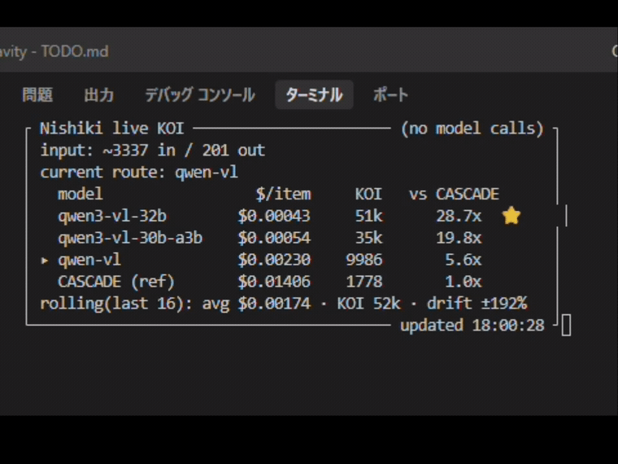
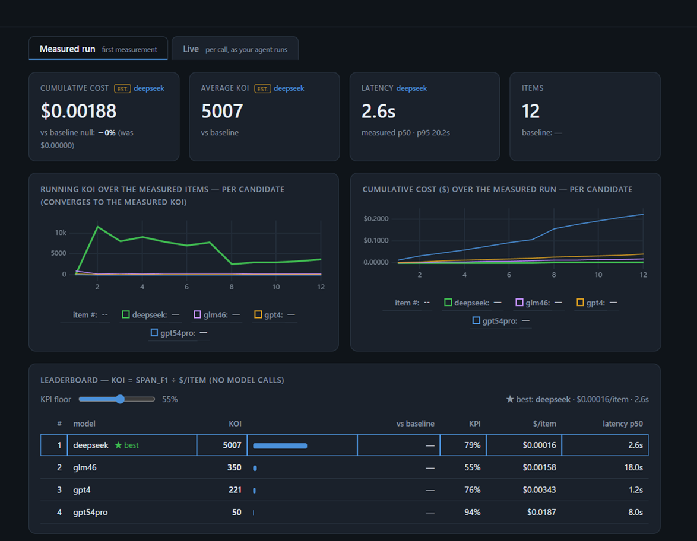

<p align="center">
  
</p>

<h1 align="center">Nishiki — the KOI optimizer</h1>

<p align="center">
  <em>Measure and maximize the KOI (KPI on Investment — the AI version of ROI) of any LLM agent.</em>
</p>

<p align="center">
  <a href="LICENSE"></a>
  
</p>

You already have an AI agent that calls a model to do a job — classify invoices, extract contract
clauses, answer support tickets. Nishiki answers the question your finance team actually cares about:

You already have an AI agent that calls a model to do a job — classify invoices, extract contract
clauses, answer support tickets. Nishiki answers the question your finance team actually cares about:

> *Which model gives the most quality per dollar — and how much cheaper can I run this without
> dropping below my quality bar?*

Nishiki reads your agent's source, figures out **what** it's measuring (the KPI), swaps the model at
the single call site, scores every candidate against your gold data, and ranks them by
**KOI = KPI ÷ cost** — disqualifying the "cheap but garbage" models with a quality floor.

## Why KOI (not just "cut cost")

Tell an org to "cut AI cost" and quality drops, so KOI gets *worse*. The right thing to maximize is the
**ratio**. But raw KOI has a trap: the cheapest model that blurts garbage looks like the best bargain.
Nishiki kills that with **floors** — a candidate must clear a minimum KPI (e.g. F1 ≥ 0.55) to even
qualify; among survivors it ranks by cost-efficiency. That's the whole game: *quality floor, then
cheapest path that clears it.*

## What makes it general

Nishiki measures **classification and non-classification** KPIs from one framework:

| Task type | KPI (scorer) | Example |
|---|---|---|
| `classification` | label match → agreement rate (+ optional safety-class recall floor) | invoice verdict OK/NG |
| `extraction` | span F1 (character/token overlap vs. gold span) | contract clause extraction (CUAD) |

The KPI type, the choke point (where the model is called), the prompt and the gold format are
**auto-detected from your source** by an orchestrator AI and written into a `KOI.yaml`. New task shapes
plug in by adding a scorer to the registry — not by hand-writing an adapter per project.

## Install

Python ≥ 3.9. Both routes give you the `nishiki` command on your PATH.

```bash
# Option A — install straight from GitHub (just want to use it):
pip install git+https://github.com/matu79go/nishiki.git

# Option B — clone first, editable install (want to read/hack the source):
git clone https://github.com/matu79go/nishiki.git
cd nishiki
pip install -e .          # -e = editable: source edits take effect immediately

# Bedrock candidates need boto3 + AWS creds — add the extra:
pip install "nishiki[bedrock] @ git+https://github.com/matu79go/nishiki.git"
```

Verify it's on your PATH:

```bash
nishiki --help
```

### Credentials

You only need creds for the candidate source you actually measure:

| Candidate source | Needs | Read from |
|---|---|---|
| OpenRouter (`call: openai_compatible`) | `OPENROUTER_API_KEY` | env |
| Bedrock (`call: on_demand` / `profile`) | AWS creds: `AWS_ACCESS_KEY_ID` / `AWS_SECRET_ACCESS_KEY` / `AWS_REGION` | env or `~/.aws/` (via boto3) |

Just put them in a **`.env`** — Nishiki **auto-loads `.env`** at startup, so you don't have to `export`
anything. Copy the bundled template and fill in your key:

```bash
cp .env.example .env
# then edit .env and paste your key after the "=":
#   OPENROUTER_API_KEY=sk-or-...
nishiki start --target /path/to/your/agent
```

`.env` is **gitignored** (only the value-less `.env.example` template is tracked) — never commit real
keys. Nishiki reads `.env` from the working directory and from the `--target` / `--experiment` dir, so
the **target project's own `.env`** is picked up too. A variable already set in your real environment
**always wins** over `.env`, so a container with `~/.aws`, `AWS_*` already exported, or CI secrets just
work — nothing extra to do.

If a source has **no** creds, its candidates can't be measured: OpenRouter raises
`OPENROUTER_API_KEY not set`, and Bedrock fails to authenticate. (When AWS auth only lives inside the
target's container, `nishiki init --catalog <fetched.json>` lets the model menu be built from a catalog
fetched in there, so you don't need AWS creds on the orchestrator host.)

## Quickstart — `nishiki start`

The whole flow is driven by an orchestrator AI that asks you a few questions and runs the commands
itself. It needs an agent CLI on your machine (`claude` or `codex`).

```bash
cd /path/to/your/agent
nishiki start --target /path/to/your/agent
```

It will:
1. **read your source** → find the model-call choke point, auto-detect the KPI type, draft `KOI.yaml`;
2. **pick candidates** across the price ladder (cheap → frontier) from OpenRouter and/or Bedrock;
3. **dry-run** the wiring for free, then stop at a **cost gate** showing the probe and full-run estimate;
4. on your GO: **probe** (a few cents) → **full run** → **KOI report** (an HTML scatter + ranking table
   with a draggable floor slider).

Nothing is charged until you approve at the cost gate. The target is **read-only** — the model swap
happens in memory; your code, DB and data are never modified.

### Re-running — just type `nishiki`

Once a project has a `.nishiki/` profile, you don't reconfigure from scratch. Run **`nishiki`** with no
arguments inside the project:

```bash
cd /path/to/your/agent
nishiki
```

It launches the orchestrator already pointed at this project, which sees the existing profile and offers
to **re-measure with the SAME models as last time** (a one-step path), or re-evaluate the last run for
free, or change the models. If you pick re-measure, it only asks the two things that usually change — the
target (the same gold/batch as before, or a new one) and the mode (cheap probe vs. full run) — as a menu
you can also answer freely, then runs it. The previous models live in `KOI.yaml`; the last run's settings
are remembered in `.nishiki/last_run.json`. (`nishiki start` still works if you prefer to type it.)

## Under the hood (the CLI the orchestrator runs)

```bash
nishiki init --target DIR --source openrouter[,bedrock]   # read source → MODELS.yaml / KOI.yaml / AGENT.md
nishiki measure --experiment DIR --mode probe|run [--dry-run] [--limit N]   # config-driven generic run
nishiki koi-report --experiment DIR                       # KOI table (HTML)
nishiki suggest-floor --experiment DIR                    # propose a failure-band price floor from past runs
```

`nishiki measure --dry-run` validates the whole pipeline (load → prompt → parse → score) with **zero
spend** — run it before any paid measurement.

## Live KOI — watch quality-per-dollar in real time



*The HUD updating per call as an agent processes items — estimated, no model calls. ([full video](assets/koi_live.mp4))*

Once you've measured, Nishiki can sit beside your **running** agent and show the KOI of each real call —
**instantly, with no model calls and no charges**. Cost is computed locally (the call's token count ×
the candidate prices); the quality is reused from your last measured run; KOI = KPI ÷ cost. As the input
varies (a big invoice image vs. a small receipt), you watch the live cost and KOI move per call.

```bash
nishiki live        # the live HUD — KOI per model for the current call, the active route, rolling stats
nishiki live --web  # the same, as a browser dashboard (cards + charts, all candidates compared)
nishiki history     # per-call history: each processed item, its tokens, cost, and KOI (--last N to tail)
```

```text
$ nishiki live
┌ Nishiki live KOI ────────────────────── (no model calls) ┐
│ input: ~5200 in / 256 out                                │
│ current route: qwen3-vl-32b                              │
│   model                 $/item     KOI   vs current      │
│   gpt-5-nano          $0.00036    2263       9.7x  ⭐     │
│ ▸ qwen3-vl-32b        $0.00062    1446       6.2x        │
│   current (ref)       $0.00389     234       1.0x        │
│ rolling(last 2): avg $0.00037 · KOI 1854 · drift ±22%    │
└──────────────────────────────────────── updated 12:04:01 ┘

$ nishiki history
    #  time      model                   in/out     $/item       KOI  vs current
    1  12:01:52  qwen3-vl-32b          5200/256   $0.00062      1446        6.2x
    2  12:02:52  gpt-5-nano            5200/256   $0.00036      2263        9.7x
    3  12:03:52  qwen3-vl-32b          3100/200   $0.00039      2308        6.2x
  — 3 calls · avg KOI 2005
```

**`nishiki live --web`** serves the same numbers as a local browser dashboard at `http://127.0.0.1:8765`
(`--port` to change it, `--no-open` to not auto-open). `nishiki koi-report --web` generates the static
report and launches this dashboard in one step (the dashboard starts in the background and the report
always prints its URL). It unifies the first-run leaderboard and the live
view into one screen: cards (cumulative cost / average KOI / latency / call count), multi-series charts
comparing *every* candidate per call (the selected model highlighted), and a floor-aware leaderboard —
click any row to focus the cards and charts on that model. It's dependency-free and fully offline (the
chart library is vendored, no CDN), and like the terminal HUD it makes **no model calls and no charges**.



*The browser dashboard (`nishiki koi-report --web`) on the bundled `samples/span_extract/` run: KOI =
KPI ÷ cost, a draggable quality floor, and the cheapest model that clears it ranked first — here a
candidate at **KOI 5007** vs. the frontier's 50, no model names or math required.*

`nishiki live` reads `<profile>/live.jsonl`, which is fed by whatever is capturing your agent's calls:

- **Agent you launch as a process** → `nishiki run --watch -- <command that starts your agent>` runs it
  with a probe on the model-call site (the `choke` from `KOI.yaml`) and shows the HUD in one terminal. No
  source edit; the probe reads the call's real usage from its return and writes only to `.nishiki/`.
- **Agent behind an OpenAI-compatible endpoint** → `nishiki relay` and point its base URL at the relay.
- **Agent in a container / a bespoke setup** → run `nishiki start` and the orchestrator wires the capture
  for *your* setup (e.g. authoring an opt-in compose overlay), then drives you to the live HUD. The goal
  is the same for everyone — a live, dynamic KOI view — only the bridge differs, and the AI builds it.

`nishiki estimate --experiment DIR --prompt … [--image …]` gives a one-off "what-if" KOI for a candidate
prompt without running anything.

## The profile (`.nishiki/`)

`nishiki init` writes a `.nishiki/` folder next to your project (a tool dotfolder, like `.git`):

- **`MODELS.yaml`** — the candidate menu (model id, price, call route), spanning the price ladder.
- **`KOI.yaml`** — *how we measure*: `task_type`, `scorer.kpi`, gold source, the choke point, the
  prompt/parser (`run:` block for the generic adapter), candidates, and the **floors**.
- **`AGENT.md`** — a source map of your agent (authored by the orchestrator).
- **`runs/`** — saved probe/run JSON; `koi_report.html`.

## Running the tests

The suite uses **no test framework** and needs **no network or API keys** — every model call is
faked/stubbed, so it runs fully offline in about a second. From the repo root:

```bash
python3 -m tests.test_scoring          # KPI scorers: label match, span-overlap F1, latency stats, registry
python3 -m tests.test_runner           # probe/run loops: candidate resolution, cost projection, error handling
python3 -m tests.test_generic_adapter  # the config-only adapter (KOI.yaml) for classification AND extraction
python3 -m tests.test_assembler        # deterministic auto-assembler: MODELS.yaml curation, candidate selection
python3 -m tests.test_cuad             # CUAD reference adapter, end-to-end (extraction → score → KOI report)
python3 -m tests.test_dotenv           # the .env auto-loader (parse, real-env-wins, autoload)
python3 -m tests.test_smoke            # module imports + CLI dispatch smoke net
```

Each suite prints a `✓` per check and ends with `✅ all tests PASS`, exiting `0` (non-zero on any
failure). For example, the CUAD end-to-end test builds a tiny in-memory SQuAD-format fixture, runs the
full *extraction → span-F1 scoring → KOI report* path against a fake backend, and asserts the best
candidate is picked — exercising the non-classification flow with **zero data and zero spend**:

```text
$ python3 -m tests.test_cuad
[test_parse_cuad]
  ✓ parse_cuad: gold span extraction / is_impossible = empty / limit
[test_parse_cuad_balance]
  ✓ parse_cuad(balance): leveled to same count, interleaved / off = all
[test_locate_spans]
  ✓ locate_spans: verbatim position / NONE / hallucination dropped / multi-line
[test_extract_clause_choke]
  ✓ extract_clause: call once / returns (text, in, out)
[test_end_to_end_run_and_report]
  ✓ E2E: CuadAdapter→mode_run (kpi=mean F1/ng=None)→koi_report picks best

✅ all tests PASS
```

The adapter under `adapters/cuad/` is the public **reference example** for a non-classification
(extraction) KPI, built on the public CUAD dataset (CC-BY 4.0, The Atticus Project). The dataset itself
is not shipped — place `CUADv1.json` yourself and point `gold.data` / `NZ_DATA` at it for a real run.

## Scope & honest limits

- The orchestrator's auto-launch needs **`claude` or `codex` installed on the machine** that runs
  `nishiki start`. Without one, drive the underlying CLI (`init` / `measure` / `koi-report`) yourself.
- Bespoke targets that can't be expressed as *dataset × prompt × parser × scorer* (e.g. an app whose
  scoring needs a live DB inside a container) keep a thin per-target adapter under `adapters/`, but
  reuse the shared scoring/runner.
- KOI cost is the **API list price** of each candidate; it's the fair "what would this cost" axis, not
  necessarily what you paid in a given experiment.

## License

Apache-2.0. See [LICENSE](LICENSE).
